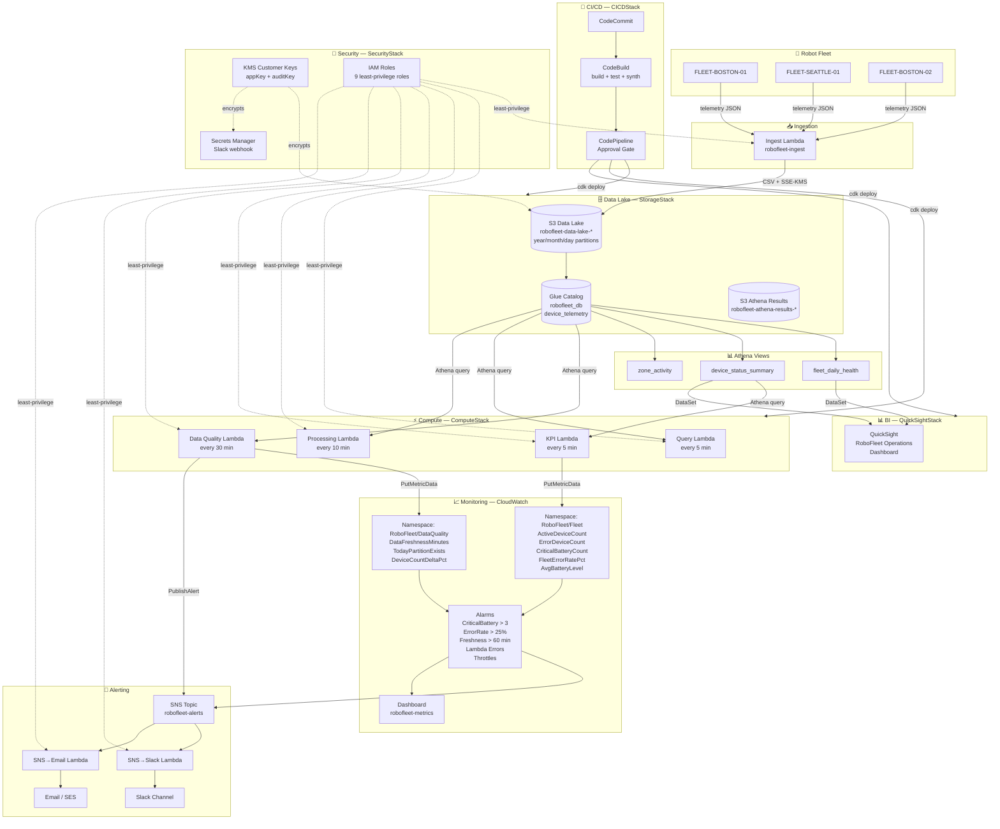

# RoboFleet Lambda CDK — Serverless Fleet Telemetry Analytics

Real-time device telemetry ingestion, analytics, and BI dashboards on AWS for autonomous robot fleets. Built with TypeScript and AWS CDK.

**Stack:** AWS CDK · TypeScript · Lambda · S3 · Glue · Athena · CloudWatch · SNS/SES · QuickSight · KMS · VPC

---

## Architecture



> **Tip:** GitHub renders this diagram automatically. To edit it, open [diagrams.net](https://app.diagrams.net) and import `docs/architecture.drawio`.

---

## Infrastructure — 6 CDK Stacks

```
SecurityStack → NetworkingStack → StorageStack → ComputeStack → CICDStack
                                      ↓
                               QuickSightStack
```

| Stack | What it creates |
|---|---|
| **SecurityStack** | 2 KMS keys, 9 IAM roles (1 per Lambda + Glue), Secrets Manager |
| **NetworkingStack** | VPC, private subnets, 7 VPC endpoints (no internet gateway) |
| **StorageStack** | S3 data lake + Athena results bucket, Glue database + table |
| **ComputeStack** | 7 Lambda functions, SNS topic, 6 CloudWatch alarms, EventBridge rules, dashboard |
| **CICDStack** | CodeCommit → CodeBuild → CodePipeline (with manual approval gate) |
| **QuickSightStack** | Athena DataSource, 2 QuickSight DataSets, IAM grants |

---

## Lambda Functions — 7 Total

| Function | Trigger | Purpose |
|---|---|---|
| `robofleet-ingest` | Direct / API Gateway | Receives telemetry JSON → writes CSV to S3 |
| `robofleet-query` | EventBridge 5 min | Ad-hoc Athena SQL queries on demand |
| `robofleet-processing` | EventBridge 10 min | Aggregates raw telemetry, optimises for Athena |
| `robofleet-sns-to-slack` | SNS | Formats and routes alerts to Slack via webhook |
| `robofleet-sns-to-email` | SNS | Formats and routes alerts via SES |
| `robofleet-kpi` | EventBridge 5 min | Queries `device_status_summary`, publishes 6 business metrics to CloudWatch |
| `robofleet-data-quality` | EventBridge 30 min | Watchdog — 3 pipeline health checks, fires SNS on failure |

---

## CloudWatch Alarms — 6 Total

| Alarm | Metric | Threshold | Namespace |
|---|---|---|---|
| `robofleet-critical-battery-count` | CriticalBatteryCount | > 3 devices | RoboFleet/Fleet |
| `robofleet-fleet-error-rate` | FleetErrorRatePct | > 25% for 2 periods | RoboFleet/Fleet |
| `robofleet-data-freshness` | DataFreshnessMinutes | > 60 min | RoboFleet/DataQuality |
| `robofleet-high-error-rate` | Lambda Errors | > 5 in 5 min | AWS/Lambda |
| `robofleet-lambda-throttling` | Lambda Throttles | Any throttle | AWS/Lambda |
| `robofleet-slow-queries` | Query Duration | Avg > 30s | AWS/Lambda |

---

## Project Structure

```
robofleet-lambda-cdk/
├── bin/
│   └── app.ts                        # CDK app — wires all 6 stacks
├── lib/stacks/
│   ├── security-stack.ts             # KMS, 9 IAM roles, Secrets Manager
│   ├── networking-stack.ts           # VPC, subnets, VPC endpoints
│   ├── storage-stack.ts              # S3, Glue database/table, Athena workgroup
│   ├── compute-stack.ts              # 7 Lambdas, SNS, CloudWatch, EventBridge
│   ├── quicksight-stack.ts           # Athena DataSource + 2 DataSets
│   └── cicd-stack.ts                 # CodeCommit, CodeBuild, CodePipeline
├── src/functions/
│   ├── ingest/index.ts               # Telemetry ingest → S3
│   ├── query/index.ts                # Athena SQL on demand
│   ├── processing/index.ts           # Aggregation + optimisation
│   ├── sns-to-slack/index.ts         # Slack alert routing
│   ├── sns-to-email/index.ts         # Email alert routing
│   ├── kpi/index.ts                  # Business KPI metrics → CloudWatch
│   └── data-quality/index.ts         # Pipeline health watchdog
├── scripts/
│   ├── athena-views.sql              # SQL for fleet_daily_health, device_status_summary, zone_activity
│   ├── setup-athena-views.sh         # CLI script to create Athena views
│   ├── verify-deployment.sh          # Post-deploy smoke tests
│   └── test_lambda_query.py          # Athena query test harness
├── tests/unit/                       # Jest unit tests (80 passing)
├── data-seed/                        # Sample telemetry CSV files (3 days)
├── docs/                             # Architecture, deployment, troubleshooting guides
└── cdk.json                          # CDK config
```

---

## Quick Start

```bash
# 1. Install dependencies
npm install

# 2. Build TypeScript
npm run build

# 3. Deploy all stacks (SecurityStack activates first due to dependencies)
npx cdk deploy --all --region us-east-1 --require-approval never

# 4. Create Athena views (required for KPI Lambda and QuickSight)
./scripts/setup-athena-views.sh

# 5. Upload sample data and register partitions
aws s3 sync data-seed/ s3://robofleet-data-lake-{account}/telemetry/
aws athena start-query-execution \
  --query-string "MSCK REPAIR TABLE device_telemetry" \
  --query-execution-context Database=robofleet_db \
  --work-group robofleet-workgroup-v3 --region us-east-1
```

> **QuickSight:** Requires one-time manual activation at the AWS console before deploying `QuickSightStack`. See [docs/DEPLOYMENT.md](docs/DEPLOYMENT.md).

---

## Data Flow

```
Robot Devices
    │  JSON telemetry
    ▼
Ingest Lambda ──SSE-KMS──▶ S3 Data Lake
                              │  year/month/day partitions
                              ▼
                         Glue Catalog (device_telemetry)
                              │
               ┌──────────────┼──────────────────┐
               │              │                  │
               ▼              ▼                  ▼
          KPI Lambda    Data Quality        Query Lambda
          (every 5min)  Lambda (30min)      (every 5min)
               │              │
               ▼              ▼
         CloudWatch ◄──────── SNS ──▶ Slack / Email
         Custom Metrics       │
               │              ▼
         Alarms ──▶ SNS   (on failures)
               │
               ▼
         QuickSight ◄── Athena Views ── fleet_daily_health
         Dashboard                      device_status_summary
```

---

## Security Design

| Control | Implementation |
|---|---|
| Encryption at rest | KMS customer-managed keys (`alias/robofleet-app-key`) on all S3 data |
| Encryption in transit | TLS enforced on all S3 bucket policies |
| Network isolation | Private VPC only — no internet gateway, no NAT |
| Service connectivity | 7 VPC interface endpoints (AWS services never leave the AWS network) |
| Least-privilege IAM | 1 role per Lambda — no shared roles, no `*` actions |
| Secrets | Slack webhook + email config in Secrets Manager (never in env vars) |
| Upload enforcement | S3 bucket policy denies any unencrypted `PutObject` |

---

## Cost Estimate (personal/dev usage)

| Service | Usage | Est. Cost/Month |
|---|---|---|
| VPC Interface Endpoints | 7 endpoints | ~$50 |
| Lambda | 7 functions, light traffic | ~$1 |
| S3 | 100GB data lake | ~$2 |
| Athena | ~10GB scanned | ~$0.05 |
| KMS | 2 keys | ~$1 |
| CloudWatch | 10 custom metrics, 6 alarms | ~$3 |
| QuickSight Standard | 1 author | $9 |
| **Total** | | **~$70/month** |

> Tip: Stop VPC endpoints when not actively developing to reduce cost.

---

## Documentation

| Doc | Description |
|---|---|
| [docs/ARCHITECTURE.md](docs/ARCHITECTURE.md) | Deep-dive: schema, Lambda details, Athena views, monitoring |
| [docs/DEPLOYMENT.md](docs/DEPLOYMENT.md) | Step-by-step deployment including QuickSight setup |
| [docs/TROUBLESHOOTING.md](docs/TROUBLESHOOTING.md) | IAM, KMS, Athena workgroup common issues and fixes |
| [docs/LAMBDA_TESTING.md](docs/LAMBDA_TESTING.md) | How to invoke and verify each Lambda function |

---

**CDK:** 2.x | **Node.js:** 20.x | **Region:** us-east-1 | **Tests:** 80 passing
